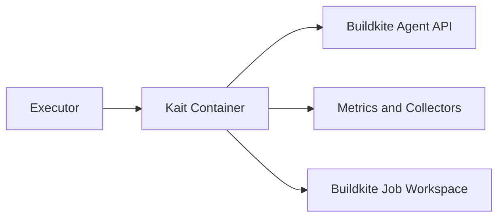

# Architecture

## Direction
Infra-oriented container architecture with explicit runtime boundaries and
proof-backed delivery invariants.

## What This Project Is
Kait is the open-source AI runtime for self-hosted Buildkite. It packages the
agent, standard Python toolchain, hardware runtime, process supervision, and
observability adapters into deployable Linux images or a reserved native macOS
worker path.

## Runtime Boundary
Kait is a Go supervisor packaged into hardware-specific Linux images with a
reserved native macOS arm64 Apple MPS worker path. The supervisor owns process lifecycle,
input validation, health endpoints, metrics, structured logs, and Buildkite
agent invocation. Buildkite remains the system that dispatches and records
jobs.

## Principles
- Simplicity: the Buildkite agent remains the job executor.
- Modularity: hardware images vary by base image and build-time packages, not
  by the Buildkite or workload contract.
- Reliability: PID 1 signal handling, health/readiness endpoints, and child
  exit propagation are verified in Go.
- Collector friendliness: vendor credentials live in Datadog/Splunk agents or
  collectors; Kait exposes stable signals and never owns those secrets.

## Current Facts
- Runtime/languages: Go supervisor, Ubuntu-based Docker images, Python venv.
- Hardware surfaces: Ubuntu CPU containers, reserved native macOS Apple Silicon
  MPS, CUDA/NVIDIA, ROCm/AMD, and Intel oneAPI.
- Toolchain: Go/Buildkite in every image; the embedded capability model resolves
  the six profiles `slim`, `full`, `data-science`, `training`, `orchestration`,
  and `serving` into ordered requirement manifests and smoke programs. CPU
  CPU containers are the active contract; Apple MPS and vendor-specific native
  extensions remain operator extras until their inactive host paths are enabled
  and proven.
- Product type: self-hosted Buildkite AI runtime.

## Capability Contract
Kait keeps hardware and workload capability as separate contracts. The
authoritative `cmd/kait/capability-contract.json` model resolves the public
profiles into dependency composition, compatibility variants, baked identity,
smoke programs, and release matrix rows. Docker writes container identity to
`/etc/kait/identity.json`; native Apple bundles install the same identity under
`/Library/Application Support/Kait`. The Go supervisor refuses a missing or
conflicting identity, smoke-tests representative programs, and advertises
canonical runtime, accelerator, hardware, and `kait.capability.<name>=true`
Buildkite tags per declared capability. Pipeline selectors therefore consume
an artifact-backed contract, while organizations can derive images from an
immutable Kait base without rebuilding the common supervisor and hardware
substrate.

## Architecture Map
- `cmd/kait/`: Go supervisor split by concern — `main`, `config`, `contract`,
  `run`, `metrics`, `doctor`/`smoke`, `hardware`, `log`, `version` — plus
  capability contract tests.
- `docs/architecture.md`: human-facing deep dive (supervisor layout, image
  matrix, deploy paths, observability model, failure/exit codes, release flow).
- `Dockerfile` + `docker-bake.hcl`: shared image implementation and matrix.
- `requirements/`: leaf Python manifests selected by the embedded capability model.
- `deploy/`: Docker launcher, Kubernetes one-shot Job template, and native
  macOS Apple MPS bundle scripts.
- `examples/`: Buildkite agent-targeting snippets.
- Root `README.md` + `CONTRIBUTING.md`: quick start and contributor entry;
  the README links to `docs/architecture.md` for the longer story.

The container matrix uses Ubuntu/glibc. Each hardware target projects six
public profiles. **Published platforms (active release):** CPU images are
`linux/amd64` + `linux/arm64`. Apple is reserved as a native `darwin/arm64`
contract, while NVIDIA, AMD, and Intel remain manual opt-ins and are
`linux/amd64` container contracts. Versioned container tags are
`<tag>-<hardware>-<profile>`. A musl/Alpine image would be a separate
dependency contract and is not treated as equivalent.

Image delivery is host-matrixed. Active CI builds and runs `kait smoke` on
native Linux CPU hosts. Accelerator definitions and their
`kait-nvidia` / `kait-amd` / `kait-intel` runner labels remain manual
opt-ins so a green release cannot queue work on missing GPU infrastructure.

## Documentation Publication Surface
Kait's public documentation is a static GitHub Pages site sourced from
main/docs. docs/index.md is the landing page and routes readers to the
architecture, capability-contract, and execution-substrate documents. The
docs directory owns the Jekyll configuration and shared layout; the site does
not require an application server or a separate deployment workflow. The
execution-substrate article explains Buildkite as the execution substrate and
positions Kait as the validated capability layer that makes that model
concrete for power users. It closes by returning to the governing invariant:
the workload changes; the execution model remains.

## Strongest Existing Primitives
- Go standard-library supervisor (no third-party runtime deps); version constant
  aligned with the published package version.
- Buildkite agent `start` environment contract and file-token support.
- Docker Bake target inheritance for hardware and slim/full variants.
- Kubernetes Secret, resource, and pod environment inputs.

## Data Flows
1. Docker or Kubernetes injects environment and device resources.
2. Kait loads the mandatory baked identity and validates KAIT_HARDWARE,
   KAIT_VARIANT, KAIT_PROFILE, KAIT_O11Y, and Buildkite credentials against it.
3. Kait starts buildkite-agent start, which polls Buildkite and executes jobs.
4. Metrics are scraped by Prometheus or forwarded to DogStatsD/OTel
   collectors; logs remain structured on stdout/stderr.

```text
Docker/Kubernetes -> Kait supervisor -> Buildkite agent -> Buildkite jobs
                         |                 |
                         +-> /metrics     +-> stdout/stderr
                                           +-> DogStatsD/OTel collector
```

## Topology
```text
Docker/Kubernetes -> Kait -> Buildkite Agent API
        |             |              |
   device nodes   /metrics       Buildkite jobs
        |             |
   GPU runtime   collectors
```

## Store Boundaries


## Happy Path Sequence
Executor injects token and hardware settings -> Kait validates inputs ->
agent registers with Buildkite -> Buildkite dispatches a job -> job runs in
the selected image -> logs, artifacts, and metrics leave through their
configured systems.

## Error Path
Invalid runtime input fails closed with exit 2. An unavailable agent binary,
metrics listener, or child process returns a non-zero status and is visible in
structured logs. The orchestrator owns restart and rollback.

## Execution Path
- Ingress parse and validation: load KAIT_* and BUILDKITE_* inputs.
- Policy checks: require a token in agent mode and validate the o11y enum.
- Core execution: start and supervise the Buildkite child process.
- Verification: expose health/metrics and propagate the child exit status.

## Concurrency and Runtime Model
- Execution model: one supervisor process and one Buildkite child process.
- Isolation boundaries: container, Buildkite build path, and operator-provided
  device mounts.
- Backpressure strategy: Buildkite queue and agent concurrency settings.
- Shared state synchronization: atomic runtime counters; no shared database.

## Deployment Topology
- Runtime units: one long-lived agent or one-shot Kubernetes Job per hardware
  pool.
- Region/zone model: selected by the operator's Docker host or Kubernetes node
  pool.
- Rollout: publish immutable image tags and roll queues forward.
- Rollback: move the queue back to the prior tag after startup, health, or job
  regressions.

## Data and Contracts
- Inbound contracts: environment variables, mounted token files, and device
  resources.
- Outbound dependencies: Buildkite Agent API, optional DogStatsD, and OTLP
  collectors.
- Ownership: Buildkite owns job state, while the host owns logs, caches,
  checkpoints, and artifacts mounted into the job.
- Evolution: environment names and image tags are compatibility surfaces; any
  change requires README/spec updates and tests.

## ADR Register
| ADR | Title | Status | Rationale | Date |
|---|---|---|---|---|
| ADR-001 | Agent-in-image topology | Accepted | Keep Buildkite dispatch and the AI toolchain in one hardware-selected image | 2026-08-06 |
| ADR-002 | Split supervisor source by concern | Accepted | Keep the stdlib supervisor readable for contributors without changing runtime contracts | 2026-08-10 |
| ADR-003 | Human architecture doc under docs/ | Accepted | Keep the root README thin; park system layout in docs/architecture.md | 2026-08-10 |

## Delivery Plan
- Slice 1: supervisor, image matrix, launch templates, and o11y selector.
- Slice 2: framework-specific validated images and reference workflows.
- Slice 3: checkpoint/artifact backends, autoscaling, and collector packaging.

## Risks and Mitigations
| Risk | Likelihood | Impact | Mitigation |
|---|---|---|---|
| Accelerator base tag disappears | Medium | High | Pin tags and allow BASE_IMAGE override in Bake |
| Vendor collector is absent | Medium | Medium | Keep stdout and Prometheus endpoint usable in every mode |
| Build secrets leak into logs | Low | High | Secret-file support and no token logging |

<!-- decapod:capability-overlay:persistent-state:start -->

## Persistent State Architecture Overlay

### State Ownership
- Each entity type MUST have a designated state owner
- State ownership boundaries MUST be explicitly documented
- Cross-boundary state access MUST go through defined interfaces

### Transaction Boundaries
- All multi-entity mutations MUST occur within explicit transactions
- Transaction boundaries MUST be documented in ARCHITECTURE.md
- Compensating transactions for distributed operations

### Storage Abstraction
- Storage ownership, consistency behavior, and access boundaries MUST be explicit
- Portability or swappable implementations are project decisions, not universal requirements
- Migration and rollback treatment MUST match the selected storage technology
<!-- decapod:capability-overlay:persistent-state:end -->

<!-- decapod:codebase-attestation:start -->

## Codebase Attestation

- Repository signal fingerprint: `09785926cd7f035e50e28ff508548568636bef945ba1806b74e7a1d1c19aa712`
- Significant implementation surfaces: `.github/` (4 files), `Dockerfile/` (1 files), `Makefile/` (1 files), `README.md/` (1 files), `deploy/` (7 files), `go.mod/` (1 files), `requirements/` (1 files)
- Refreshed from the current codebase by `decapod specs.refresh`
<!-- decapod:codebase-attestation:end -->
