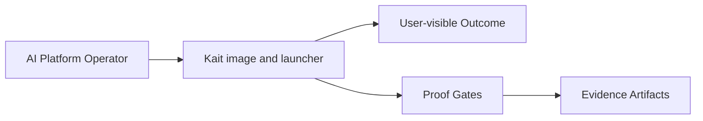

# Intent

<!-- decapod:declared-capabilities:start -->

## Declared Capability Surfaces

- `authentication`
- `background-processing`
- `event-driven`
- `external-integrations`
- `infrastructure-management`
- `persistent-state`
- `public-api`
- `secrets-handling`

<!-- decapod:declared-capabilities:end -->

## Product Outcome
Kait ships self-hosted Buildkite agents with a portable, capability-oriented
AI/ML runtime: a pinned agent, profile-derived Python toolchains, hardware image
contracts, baked identity, and collector-friendly metrics. Operators pick a
workload profile and hardware image tag, then run ordinary Buildkite jobs in
the validated execution surface.

## What This Project Is
A small Go supervisor (`cmd/kait`) packaged into hardware-specific Linux
images. Buildkite remains the orchestrator; Kait owns the authoritative
capability model, profile composition, baked identity, process supervision,
input validation, health/metrics, and diagnostic subcommands (`doctor`,
`smoke`, `hardware`). Active delivery targets are CPU and Apple Silicon
(linux/arm64). NVIDIA, AMD, and Intel profiles stay available for deliberate
host testing but are inactive in automatic CI and release until matching
runners exist.

Key operating facts:
- **Release images:** Release Please tags must dispatch `release-images.yml`
  (requires `actions: write` on the release job) or GHCR never receives
  versioned tags. After images publish, the workflow **annotates** the existing
  GitHub Release with GHCR pull lines — it must not recreate the release or
  call `gh release edit --generate-notes` (create-only; breaks re-runs).
  A release PR is opened only for user-facing conventional commits (`feat` /
  `fix` / `perf`); a squash titled `chore:` does not open one.
- **Version lockstep:** `cmd/kait` `version` constant tracks the released
  package version (currently **0.2.1**) so doctor/smoke/Prometheus match the tag.
- **Package visibility:** GHCR package visibility is independent of repo
  visibility; anonymous `docker pull` requires an explicit Public package
  setting (documented in README/CONTRIBUTING/SECURITY).
- **Decapod pin:** managed entrypoints and Dockerfile.decapod track the
  evaluating Decapod release (refresh via validate / workspace ensure).
- **Primary languages**: Go, Dockerfile, shell, YAML
- **Surfaces**: embedded capability model, Go supervisor, Docker Bake matrix,
  Docker launcher, Kubernetes Job template, Python requirement layers,
  generated Release/CI matrices, Release Please + GHCR image CI
- **Docs**: root README for operators (quick start + badges); `SECURITY.md` for
  vulnerability reporting; `docs/architecture.md` for system layout

## Product View

## Inferred Baseline
- Repository: kait
- Product type: self-hosted AI runtime image
- Primary languages: Go
- Detected surfaces: runtime, image matrix, deployment templates, CI

## Scope
| Area | In Scope | Proof Surface |
|---|---|---|
| Core workflow | Start a Buildkite agent in the selected hardware image | Go tests, container smoke tests, deployment examples |
| Data contracts | Pass Buildkite, hardware, and observability inputs explicitly | INTERFACES.md and manifest review |
| Delivery quality | Build and validate the image matrix without embedding secrets | VALIDATION.md and CI bake graph |

## Non-Goals (Falsifiable)
| Non-goal | How to falsify |
|---|---|
| Feature creep beyond the primary outcome | Any PR adds capability not tied to outcome criteria |
| Shipping without evidence | Missing validation artifacts for promoted changes |
| Ambiguous ownership boundaries | Missing owner/system-of-record in interfaces |

## Constraints
- Technical: runtime, dependency, and topology boundaries are explicit.
- Operational: deployment, rollback, and incident ownership are defined.
- Security/compliance: sensitive data handling and authz are mandatory.

## Acceptance Criteria (must be objectively testable)
- [ ] The authoritative contract defines CPU, Apple Silicon arm64, NVIDIA, AMD, and Intel hardware plus the public profiles `slim`, `full`, `data-science`, `training`, `orchestration`, and `serving`.
- [ ] Each supported hardware/profile target is versioned and reproducible from the Bake projection, with `slim`/`full` compatibility aliases preserved.
- [ ] Every published target declares its supported Linux platform; GPU images remain limited to platforms supported by their vendor runtime.
- [ ] Image CI builds and runs `kait smoke` for every active hardware/profile target on a matching host class before the workflow can pass.
- [ ] NVIDIA, AMD, and Intel jobs remain inactive on ordinary pushes and tags, with explicit manual opt-in required when matching hosts are available.
- [ ] The default entrypoint validates the Buildkite token, forwards standard agent options, and exits with the child status.
- [ ] Every image contains the pinned Buildkite agent, a mandatory contract-derived identity, and representative smoke proof for every advertised capability.
- [ ] KAIT_O11Y selects none, Prometheus, Datadog, or Splunk/OTel behavior without changing workload commands.
- [ ] Docker and Kubernetes launch paths pass environment inputs and accelerator resources without committing secrets.
- [ ] Go contract tests, generated matrix validation, bake-plan validation, CI, release workflows, documentation, and Decapod validation are present.

## Epistemic Custody Fields

### Active Assumptions
- [x] Buildkite cluster tokens are supplied at runtime through an environment variable or mounted file.
- [x] Vendor collectors/agents own Datadog and Splunk credentials; Kait emits compatible runtime signals.
- [ ] Exact accelerator base-image availability is verified by image CI and may require operator overrides.
- [x] Ubuntu/glibc is the common image contract; Apple Silicon is Linux arm64 CPU execution, not Apple Metal inside a container.

### Confidence & Risk Level
- **Confidence**: Medium (Rationale: runtime contract and local tests are concrete; accelerator builds depend on upstream base images.)
- **Risk**: Medium (Impact of wrong assumptions: a hardware image or collector integration may require a target-specific override.)

### Measured vs Inferred Facts
| Fact | Source (Provenance) | Type (Measured/Inferred) |
|---|---|---|
| Buildkite start accepts token, tags, config, and Kubernetes exec options | Buildkite agent CLI contract | Measured from official docs |
| Five hardware image targets select base images, platforms, and agent tags | docker-bake.hcl | Inferred from repository source |
| O11y modes keep credentials outside the image | runtime and deployment docs | Inferred from repository source |

### Unresolved Contradictions
- [ ] List any evidence that conflicts with current assumptions or intent.

### Deferred Questions
- [x] Should future releases publish framework-specific images separately from the base hardware images? — Yes; the six profile images are now first-class contract artifacts.
- [ ] Which collector deployment is canonical for each operator's Kubernetes platform?

### Stop Conditions
- [ ] Explicit conditions under which the agent should stop and ask for help.

### Proof Required Before Completion
- [ ] GOCACHE=/tmp/kait-gocache go test ./... passes.
- [ ] `kait matrix` resolves all 30 structural hardware/profile combinations and `docker buildx bake --print` renders the profile targets.
- [ ] GitHub Actions routes active CPU and arm64 work to native hosts; accelerator work is routed to explicit host labels only after the inactive manual path is enabled, rather than relying on emulation for device proof.
- [ ] decapod validate passes after generated artifacts and living specs are refreshed.

## Tradeoffs Register
| Decision | Benefit | Cost | Review Trigger |
|---|---|---|---|
| Simplicity vs extensibility | Faster iteration | Potential rework | Feature set expands |
| Strict gates vs dev speed | Higher confidence | More upfront discipline | Lead time regressions |

## First Implementation Slice
- [x] Start Kait as a Buildkite agent with runtime-selected hardware and o11y.
- [x] Define token, tag, metrics, collector, Docker, and Kubernetes input contracts.
- [x] Keep checkpoint stores, workflow orchestration, and vendor collector deployment automation outside Kait.

## Open Questions (with decision deadlines)
| Question | Owner | Deadline | Decision |
|---|---|---|---|
| Which interfaces are versioned at launch? | TBD | YYYY-MM-DD | |
| Which non-functional target is hardest to hit? | TBD | YYYY-MM-DD | |

<!-- decapod:codebase-attestation:start -->

## Codebase Attestation

- Repository signal fingerprint: `c70f67f5dedfa45dbe5c2c90971c52f165d80c3755cabac1982850ba12279dc0`
- Significant implementation surfaces: `.github/` (4 files), `Dockerfile/` (1 files), `Makefile/` (1 files), `README.md/` (1 files), `deploy/` (4 files), `go.mod/` (1 files), `requirements/` (1 files)
- Refreshed from the current codebase by `decapod specs.refresh`
<!-- decapod:codebase-attestation:end -->
